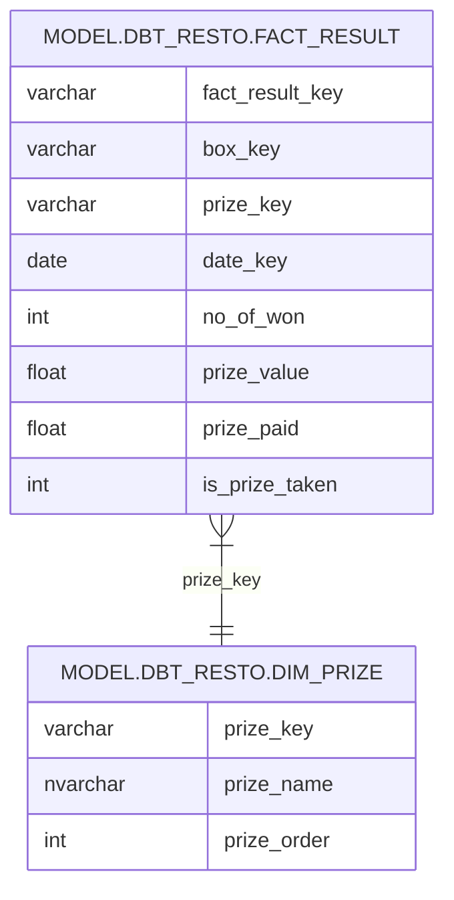

<div align="center">

# 🔗 dbterd

**Generate ERD-as-a-code from your dbt projects**

Transform your dbt artifact files or metadata into stunning Entity Relationship Diagrams using multiple formats: DBML, Mermaid, PlantUML, GraphViz, D2, and DrawDB

[](https://pypi.org/project/dbterd/)

[](https://opensource.org/licenses/MIT)
[](https://www.python.org)
[](https://codecov.io/gh/datnguye/dbterd)

[](https://github.com/datnguye/dbterd)

</div>

---

## 📋 Table of Contents

- [🔗 dbterd](#-dbterd)
  - [📋 Table of Contents](#-table-of-contents)
    - [Why dbterd?](#why-dbterd)
  - [🚀 Quick Start](#-quick-start)
    - [Installation](#installation)
    - [Verify Installation](#verify-installation)
  - [🎯 Entity Relationship Detection](#-entity-relationship-detection)
  - [💡 Examples](#-examples)
    - [CLI Examples](#cli-examples)
    - [Python API Examples](#python-api-examples)
  - [🎨 Supported Output Formats](#-supported-output-formats)
  - [🤝 Contributing](#-contributing)
  - [👥 Contributors](#-contributors)
  - [📧 Support](#-support)
    - [Sponsored by GitAds](#sponsored-by-gitads)

---

### Why dbterd?

- **🔗 Relationship Intelligence**: Automatically discovers entity relationships from your dbt project
- **📊 Multiple Output Formats**: Generate diagrams in your preferred format
- **⚡ Fast & Lightweight**: Quick processing of large dbt projects  
- **🎛️ Highly Configurable**: Fine-tune what gets included in your ERD
- **🐍 Python Integration**: Use as CLI tool or integrate into your Python workflows
- **☁️ Flexibility**: Works with both dbt Core and dbt Cloud

---

## 🚀 Quick Start

### Installation

```bash
pip install dbterd --upgrade
```

### Verify Installation

```bash
dbterd --version
```

> [!TIP]
> **For dbt-core Users**: Upgrade `dbt-artifacts-parser` to support newer dbt-core versions:
> ```bash
> pip install dbt-artifacts-parser --upgrade
> ```

---

## 🎯 Entity Relationship Detection

dbterd intelligently detects entity relationships through:

- **🧪 [Test Relationships](https://docs.getdbt.com/reference/resource-properties/data-tests#relationships)** (default method)
- **🏛️ [Semantic Entities](https://docs.getdbt.com/docs/build/entities)** (use `-a` option)

For detailed configuration options, see our [CLI References](https://dbterd.datnguyen.de/latest/nav/guide/cli-references.html#dbterd-run-algo-a).

---

## 💡 Examples

### CLI Examples

<details>
<summary>🖱️ <strong>Click to explore CLI examples</strong></summary>

```bash
# 📊 Select all models in dbt_resto
dbterd run -ad samples/dbtresto

# 🎯 Select multiple dbt resources (models + sources)
dbterd run -ad samples/dbtresto -rt model -rt source

# 🔍 Select models excluding staging
dbterd run -ad samples/dbtresto -s model.dbt_resto -ns model.dbt_resto.staging

# 📋 Select by schema name
dbterd run -ad samples/dbtresto -s schema:mart -ns model.dbt_resto.staging

# 🏷️ Select by full schema name
dbterd run -ad samples/dbtresto -s schema:dbt.mart -ns model.dbt_resto.staging

# 🌟 Other sample projects
dbterd run -ad samples/fivetranlog -rt model -rt source
dbterd run -ad samples/facebookad -rt model -rt source
dbterd run -ad samples/shopify -s wildcard:*shopify.shopify__*

# 🔗 Custom relationship detection
dbterd run -ad samples/dbt-constraints -a "test_relationship:(name:foreign_key|c_from:fk_column_name|c_to:pk_column_name)"

# 💻 Your local project
dbterd run -ad samples/local -rt model -rt source
```

</details>

### Python API Examples

**Generate Complete ERD**

```python
from dbterd.api import DbtErd

# Generate DBML format
erd = DbtErd().get_erd()
print("ERD (DBML):", erd)

# Generate Mermaid format
erd = DbtErd(target="mermaid").get_erd()
print("ERD (Mermaid):", erd)
```

**Generate Single Model ERD**

```python
from dbterd.api import DbtErd

# Get ERD for specific model
dim_prize_erd = DbtErd(target="mermaid").get_model_erd(
    node_unique_id="model.dbt_resto.dim_prize"
)
print("ERD of dim_prize (Mermaid):", dim_prize_erd)
```

**Sample Output:**



---

## 🎨 Supported Output Formats

| Format | Description | Use Case |
|--------|-------------|----------|
| **[DBML](https://dbdiagram.io/d)** | Database Markup Language | Interactive web diagrams |
| **[Mermaid](https://mermaid-js.github.io/mermaid-live-editor/)** | Markdown-friendly diagrams | Documentation, GitHub |
| **[PlantUML](https://plantuml.com/ie-diagram)** | Text-based UML | Technical documentation |
| **[GraphViz](https://graphviz.org/)** | DOT graph description | Complex relationship visualization |
| **[D2](https://d2lang.com/)** | Modern diagram scripting | Beautiful, customizable diagrams |
| **[DrawDB](https://drawdb.vercel.app/)** | Web-based database designer | Interactive database design |

🎯 **[Try the Quick Demo](https://dbterd.datnguyen.de/latest/nav/guide/targets/generate-dbml.html)** with DBML format!

---

## 🤝 Contributing

We welcome contributions! 🎉

**Ways to contribute:** 🐛 Report bugs | 💡 Suggest features  | 📝 Improve documentation | 🔧 Submit pull requests

See our **[Contributing Guide](https://dbterd.datnguyen.de/latest/nav/development/contributing-guide.html)** for detailed information.

**Show your support:**
- ⭐ Star this repository
- 📢 Share on social media
- ✍️ Write a blog post
- ☕ [Buy me a coffee](https://www.buymeacoffee.com/datnguye)

[](https://www.buymeacoffee.com/datnguye)

---

## 👥 Contributors

A huge thanks to our amazing contributors! 🙏

<a href="https://github.com/datnguye/dbterd/graphs/contributors">
  
</a>

---

## 📧 Support

**Need help?** We're here for you! Check 📖 [Documentation](https://dbterd.datnguyen.de/), 🐛 [Report Issues](https://github.com/datnguye/dbterd/issues) and 💬 [Discussions](https://github.com/datnguye/dbterd/discussions)

---

<div align="center">

**Made with ❤️ by the dbterd community**

---

### Sponsored by GitAds
[](https://gitads.dev/v1/ad-track?source=datnguye/dbterd@github)

<!-- GitAds-Verify: KHY1BVKH7W6UIGSKX7AOWMA6LBQH9FVS -->

</div>