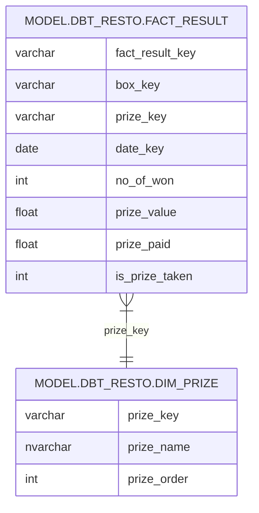

<div style="display: flex; align-items: center; justify-content: space-between;">
  <div>
    <h1 style="margin: 0;">dbterd</h1>
    <p style="margin: 0; font-weight: bold;">Generate ERD-as-a-code from your dbt projects</p>
  </div>
  
</div>

Transform your dbt artifact files or metadata into stunning Entity Relationship Diagrams using multiple formats: DBML, Mermaid, PlantUML, GraphViz, D2, DrawDB, and a canonical JSON payload

[](https://dbterd.datnguye.me/)
[](https://pypi.org/project/dbterd/)

[](https://opensource.org/licenses/MIT)
[](https://www.python.org)
[](https://codecov.io/gh/datnguye/dbterd)

[](https://github.com/datnguye/dbterd)

## 🚀 Quick Start

Two ways to get your first ERD on screen — pick whichever matches your mood:

**🖱️ Prefer a GUI?** Install the **[dbterd for VS Code](https://github.com/datnguye/dbterd-vscode)** extension, open your dbt project, and explore interactive ERDs without touching the command line.

**⌨️ Prefer the CLI?**

```bash
pip install dbterd --upgrade
dbterd run -ad samples/dbtresto
```

That's it — your diagram is generated. Read on for the full tour.

## 🎯 Entity Relationship Detection

dbterd intelligently detects entity relationships through three algorithms — pick the one that matches how your dbt project expresses its data contracts:

- **🧪 [Test Relationships](https://docs.getdbt.com/reference/resource-properties/data-tests#relationships)** *(default)* — infers relationships from dbt `relationships` data tests
- **🏛️ [Semantic Entities](https://docs.getdbt.com/docs/build/entities)** (`-a entity_relationship`) — detects relationships via dbt Semantic Layer entity definitions
- **📜 [Model Contract Constraints](https://docs.getdbt.com/docs/collaborate/govern/model-contracts)** (`-a model_contract`) — detects relationships via dbt model contract's `foreign_key` constraints (dbt 1.9+ / manifest v12+)

For detailed configuration options, see our [CLI References](https://dbterd.datnguye.me/latest/nav/guide/cli-references.html#dbterd-run-algo-a).

## 🎨 Supported Output Formats

No need to pick just one — dbterd has a format for every occasion, from quick GitHub previews to full-blown interactive database designers.

| Format | Description | Use Case |
|--------|-------------|----------|
| **[DBML](https://dbdiagram.io/d)** | Database Markup Language | Interactive web diagrams |
| **[Mermaid](https://mermaid-js.github.io/mermaid-live-editor/)** | Markdown-friendly diagrams | Documentation, GitHub |
| **[PlantUML](https://plantuml.com/ie-diagram)** | Text-based UML | Technical documentation |
| **[GraphViz](https://graphviz.org/)** | DOT graph description | Complex relationship visualization |
| **[D2](https://d2lang.com/)** | Modern diagram scripting | Beautiful, customizable diagrams |
| **[DrawDB](https://drawdb.vercel.app/)** | Web-based database designer | Interactive database design |
| **[JSON](https://dbterd.datnguye.me/latest/nav/guide/targets/generate-json.html)** | Canonical, schema-validated ERD payload | Tooling & integrations (VS Code extension, custom apps) |

🎯 **[Try the DBML Demo](https://dbterd.datnguye.me/latest/nav/guide/targets/generate-dbml.html)**, or see the **[canonical JSON payload](https://dbterd.datnguye.me/latest/nav/guide/targets/generate-json.html)** that powers the VS Code extension and docs sites!

## 🌟 Ecosystem

`dbterd` plays well with others. These companion projects build on top (and "down")of it to take your ERDs beyond the command line:

| Project                  | What it does |
|--------------------------|--------------|
| [](https://github.com/datnguye/dbterd-vscode) | **[dbterd-vscode](https://github.com/datnguye/dbterd-vscode)** — a VS Code extension that turns your dbt project into interactive ERDs without ever leaving your editor, powered by `dbterd` under the hood. |
| [](https://dbdocs.datnguye.me/latest/) | **[`dbdocs`](https://dbdocs.datnguye.me/latest/)** — an alternative dbt docs site — catalog, ERD, and column-level lineage baked into a single self-contained HTML file. |
| [](https://github.com/datnguye/artifact-parser) | **[`artifact-parser`](https://github.com/datnguye/artifact-parser)** — a pluggable framework that converts JSON artifacts into typed, validated Python objects |

## 🚀 Installation

> **Requires Python 3.10+.** `dbterd` **1.25** was the last release to support Python 3.9; support was dropped **since 1.26**, as 3.9 reached end-of-life in October 2025 and the dbt 1.11 artifact parser emits `X | Y` type annotations that won't evaluate on it anyway. If you're still on 3.9, pin `dbterd==1.25.*` — otherwise upgrade your interpreter (it's worth it).

```bash
pip install dbterd --upgrade
```

Verify Installation:

```bash
dbterd --version
```

> [!TIP]
> **For dbt-core users**: It's highly recommended to keep [`artifact-parser`](https://github.com/datnguye/artifact-parser) updated to the latest version to support newer `dbt-core` versions and their [manifest/catalog json schemas](https://schemas.getdbt.com/):
> ```bash
> pip install "artifact-parser[dbt]" --upgrade
> ```

## ⚙️ Configuration Files

Tired of typing the same CLI arguments repeatedly? Your fingers deserve better. `dbterd` supports configuration files to streamline your workflow!

```bash
# Initialize a configuration file
dbterd init

# Now just run with your saved settings
dbterd run
```

**Supported formats:**
- `.dbterd.yml` - YAML configuration (recommended)
- `pyproject.toml` - Add `[tool.dbterd]` section to your existing Python project config

Learn more in the [Configuration Files Guide](https://dbterd.datnguye.me/latest/nav/guide/configuration-file.html).

## 💡 Examples

### CLI Examples

<details>
<summary>🖱️ <strong>Click to explore CLI examples</strong></summary>

```bash
# 📊 Select all models in dbt_resto
dbterd run -ad samples/dbtresto

# 🎯 Select multiple dbt resources (models + sources)
dbterd run -ad samples/dbtresto -rt model -rt source

# 🔍 Select models excluding staging
dbterd run -ad samples/dbtresto -s model.dbt_resto -ns model.dbt_resto.staging

# 📋 Select by schema name
dbterd run -ad samples/dbtresto -s schema:mart -ns model.dbt_resto.staging

# 🏷️ Select by full schema name
dbterd run -ad samples/dbtresto -s schema:dbt.mart -ns model.dbt_resto.staging

# 🌟 Other sample projects
dbterd run -ad samples/fivetranlog -rt model -rt source
dbterd run -ad samples/facebookad -rt model -rt source
dbterd run -ad samples/shopify -s wildcard:*shopify.shopify__*

# 🔗 Custom relationship detection
dbterd run -ad samples/dbt-constraints -a "test_relationship:(name:foreign_key|c_from:fk_column_name|c_to:pk_column_name)"

# 💻 Your local project
dbterd run -ad samples/local -rt model -rt source
```

</details>

### Python API Examples

**Generate Complete ERD**

```python
from dbterd.api import DbtErd

# Generate DBML format
erd = DbtErd().get_erd()
print("ERD (DBML):", erd)

# Generate Mermaid format
erd = DbtErd(target="mermaid").get_erd()
print("ERD (Mermaid):", erd)

# Generate canonical JSON payload (nodes/edges/metadata)
erd = DbtErd(target="json").get_erd()
print("ERD (JSON):", erd)
```

**Generate Single Model ERD**

```python
from dbterd.api import DbtErd

# Get ERD for specific model
dim_prize_erd = DbtErd(target="mermaid").get_model_erd(
    node_unique_id="model.dbt_resto.dim_prize"
)
print("ERD of dim_prize (Mermaid):", dim_prize_erd)
```

**Sample Output:**


```mermaid
erDiagram
  "MODEL.DBT_RESTO.DIM_PRIZE" {
    varchar prize_key
    nvarchar prize_name
    int prize_order
  }
  "MODEL.DBT_RESTO.FACT_RESULT" {
    varchar fact_result_key
    varchar box_key
    varchar prize_key
    date date_key
    int no_of_won
    float prize_value
    float prize_paid
    int is_prize_taken
  }
  "MODEL.DBT_RESTO.FACT_RESULT" }|--|| "MODEL.DBT_RESTO.DIM_PRIZE": prize_key
```

---

## 🤝 Contributing

We welcome contributions! Whether you've found a bug, dreamed up a feature, or just want to fix a typo — you're very welcome here.

**Ways to contribute:** 🐛 Report bugs | 💡 Suggest features | 📝 Improve documentation | 🔧 Submit pull requests

See our **[Contributing Guide](https://dbterd.datnguye.me/latest/nav/development/contributing-guide.html)** for detailed information.

**Show your support:**
- ⭐ Star this repository
- 📢 Share on social media
- ✍️ Write a blog post
- ☕ [Buy me a coffee](https://www.buymeacoffee.com/datnguye)

[](https://www.buymeacoffee.com/datnguye)

## 👥 Contributors

A huge thanks to our amazing contributors — the people who turned "wouldn't it be nice if..." into actual working code. 🙏

<a href="https://github.com/datnguye/dbterd/graphs/contributors">
  
</a>

## 📧 Support

**Need help?** We're here for you! Check 📖 [Documentation](https://dbterd.datnguye.me/), 🐛 [Report Issues](https://github.com/datnguye/dbterd/issues) and 💬 [Discussions](https://github.com/datnguye/dbterd/discussions)


<a href="https://www.star-history.com/?repos=datnguye%2Fdbterd&type=date&legend=top-left">
 <picture>
   <source media="(prefers-color-scheme: dark)" srcset="https://api.star-history.com/image?repos=datnguye/dbterd&type=date&theme=dark&legend=top-left" />
   <source media="(prefers-color-scheme: light)" srcset="https://api.star-history.com/image?repos=datnguye/dbterd&type=date&legend=top-left" />
   
 </picture>
</a>

---

<div align="center">

**Made with ❤️ by the dbterd community**

---

### Sponsored by GitAds
[](https://gitads.dev/v1/ad-track?source=datnguye/dbterd@github)

<!-- GitAds-Verify: KHY1BVKH7W6UIGSKX7AOWMA6LBQH9FVS -->

</div>
