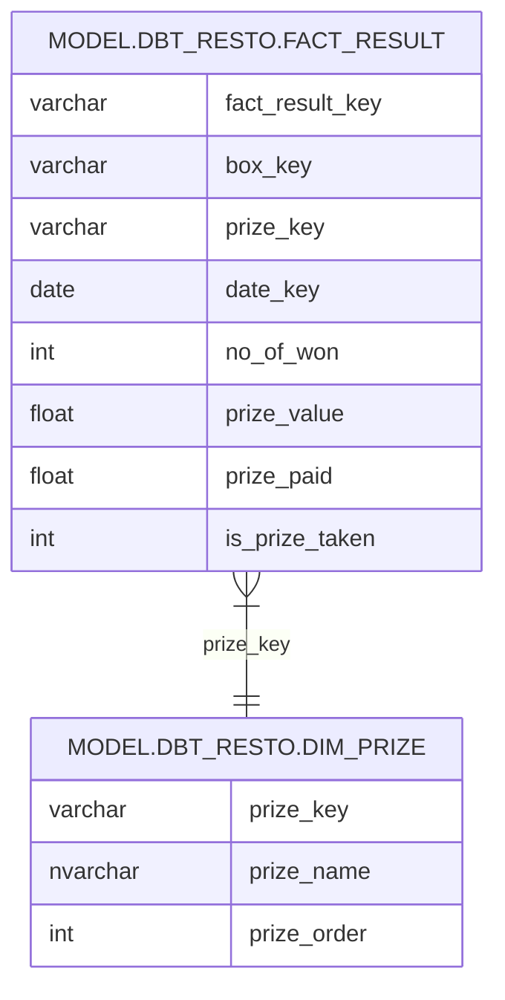

<div style="display: flex; align-items: center; justify-content: space-between;">
  <div>
    <h1 style="margin: 0;">dbterd</h1>
    <p style="margin: 0; font-weight: bold;">Generate ERD-as-a-code from your dbt projects</p>
  </div>
  
</div>

Transform your dbt artifact files or metadata into stunning Entity Relationship Diagrams using multiple formats: DBML, Mermaid, PlantUML, GraphViz, D2, and DrawDB

[](https://dbterd.datnguye.me/)
[](https://pypi.org/project/dbterd/)

[](https://opensource.org/licenses/MIT)
[](https://www.python.org)
[](https://codecov.io/gh/datnguye/dbterd)

[](https://github.com/datnguye/dbterd)

---

## 🎯 Entity Relationship Detection

dbterd intelligently detects entity relationships through:

- **🧪 [Test Relationships](https://docs.getdbt.com/reference/resource-properties/data-tests#relationships)** (default method)
- **🏛️ [Semantic Entities](https://docs.getdbt.com/docs/build/entities)** (use `-a semantic` option)
- **📜 [Model Contract Constraints](https://docs.getdbt.com/docs/collaborate/govern/model-contracts)** (use `-a model_contract` option, requires dbt 1.9+ / manifest v12+)

For detailed configuration options, see our [CLI References](./nav/guide/cli-references.md#dbterd-run-algo-a).

## 🎨 Supported Output Formats

| Format | Description | Use Case |
|--------|-------------|----------|
| **[DBML](https://dbdiagram.io/d)** | Database Markup Language | Interactive web diagrams |
| **[Mermaid](https://mermaid-js.github.io/mermaid-live-editor/)** | Markdown-friendly diagrams | Documentation, GitHub |
| **[PlantUML](https://plantuml.com/ie-diagram)** | Text-based UML | Technical documentation |
| **[GraphViz](https://graphviz.org/)** | DOT graph description | Complex relationship visualization |
| **[D2](https://d2lang.com/)** | Modern diagram scripting | Beautiful, customizable diagrams |
| **[DrawDB](https://drawdb.vercel.app/)** | Web-based database designer | Interactive database design |

---

## 🚀 Installation

!!! warning "Requires Python 3.10+"
    `dbterd` **1.25** was the last release to support Python 3.9; support was dropped **since 1.26**. Python 3.9 reached end-of-life in October 2025, and the dbt 1.11 artifact parser emits `X | Y` type annotations that won't evaluate on it anyway — so upgrading your interpreter is the way forward (it's worth it). Still stuck on 3.9? Pin `dbterd==1.25.*`.

<div class="termynal" data-termynal data-ty-typeDelay="40" data-ty-lineDelay="700">
    <span data-ty="input">pip install dbterd --upgrade</span>
    <span data-ty="progress"></span>
    <span data-ty>Successfully installed dbterd</span>
    <a href="#" data-terminal-control="">restart ↻</a>
</div>

Verify Installation:

```bash
dbterd --version
```

!!! Tip "For `dbt-core` users"
    It's highly recommended to keep [`dbt-artifacts-parser`](https://github.com/yu-iskw/dbt-artifacts-parser) updated to the latest version to support newer `dbt-core` versions and their [manifest/catalog json schemas](https://schemas.getdbt.com/):

    ```bash
    pip install dbt-artifacts-parser --upgrade
    ```

---

## ⚙️ Configuration Files

Tired of typing the same CLI arguments repeatedly? `dbterd` supports configuration files to streamline your workflow!

```bash
# Initialize a configuration file
dbterd init

# Now just run with your saved settings
dbterd run
```

**Supported formats:**

- `.dbterd.yml` - YAML configuration (recommended)
- `pyproject.toml` - Add `[tool.dbterd]` section to your existing Python project config

Learn more in the [Configuration Files Guide](./nav/guide/configuration-file.md).

---

## 💡 Examples

### CLI Examples

<details>
<summary>🖱️ <strong>Click to explore CLI examples</strong></summary>

```bash
# 📊 Select all models in dbt_resto
dbterd run -ad samples/dbtresto

# 🎯 Select multiple dbt resources (models + sources)
dbterd run -ad samples/dbtresto -rt model -rt source

# 🔍 Select models excluding staging
dbterd run -ad samples/dbtresto -s model.dbt_resto -ns model.dbt_resto.staging

# 📋 Select by schema name
dbterd run -ad samples/dbtresto -s schema:mart -ns model.dbt_resto.staging

# 🏷️ Select by full schema name
dbterd run -ad samples/dbtresto -s schema:dbt.mart -ns model.dbt_resto.staging

# 🌟 Other sample projects
dbterd run -ad samples/fivetranlog -rt model -rt source
dbterd run -ad samples/facebookad -rt model -rt source
dbterd run -ad samples/shopify -s wildcard:*shopify.shopify__*

# 🔗 Custom relationship detection
dbterd run -ad samples/dbt-constraints -a "test_relationship:(name:foreign_key|c_from:fk_column_name|c_to:pk_column_name)"

# 💻 Your local project
dbterd run -ad samples/local -rt model -rt source
```

</details>

### Python API Examples

- Generate a Complete ERD:

```python
from dbterd.api import DbtErd

# Generate DBML format
erd = DbtErd().get_erd()
print("ERD (DBML):", erd)

# Generate Mermaid format
erd = DbtErd(target="mermaid").get_erd()
print("ERD (Mermaid):", erd)
```

- Generate a Single Model ERD:

```python
from dbterd.api import DbtErd

# Get ERD for specific model
dim_prize_erd = DbtErd(target="mermaid").get_model_erd(
    node_unique_id="model.dbt_resto.dim_prize"
)
print("ERD of dim_prize (Mermaid):", dim_prize_erd)
```

**Sample Output:**



🎯 **[Try the Quick Demo](./nav/guide/targets/generate-dbml.md)** with DBML format!

---

## 🤝 Contributing

We welcome contributions! 🎉

**Ways to contribute:** 🐛 Report bugs | 💡 Suggest features | 📝 Improve documentation | 🔧 Submit pull requests

See our **[Contributing Guide](./nav/development/contributing-guide.md)** for detailed information.

**Show your support:**
- ⭐ Star this repository
- 📢 Share on social media
- ✍️ Write a blog post
- ☕ [Buy me a coffee](https://www.buymeacoffee.com/datnguye)

[](https://www.buymeacoffee.com/datnguye)

## 👥 Contributors

A huge thanks to our amazing contributors! 🙏

<a href="https://github.com/datnguye/dbterd/graphs/contributors">
  
</a>

---

<div align="center">

**Made with ❤️ by the dbterd community**

</div>
