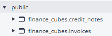
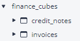

# CLI Reference (dbterd)

Run `dbterd --help` or `dbterd -h` to see the basic guideline for CLI Reference.

## Sample Datasets

The project includes several sample datasets in the `samples/` directory that you can use to test and explore the CLI commands:

- `samples/jaffle-shop/`: A simple dbt artifacts with customers, orders, and payments models
- `samples/dbtresto/`: A more complex artifacts with dimension and fact tables for analysis
- `samples/dbt-constraints/`: Demonstrates using constraints for relationships
- `samples/facebookad/`, `samples/fivetranlog/`, `samples/shopify/`: Additional sample artifacts

The examples below show how to use these sample datasets with dbterd commands.

<div class="termynal" data-termynal data-ty-typeDelay="40" data-ty-lineDelay="700">
    <span data-ty="input" data-ty-prompt="$ ~/repo>">dbterd -h</span>
    <span data-ty>Usage: dbterd [OPTIONS] COMMAND [ARGS]...<br />
<br />
Tools for producing diagram-as-code.<br />
<br />
Options:<br />
--version   Show the version and exit.<br />
-h, --help  Show this message and exit.<br />
<br />
Commands:<br />
debug         Inspect the hidden magics.<br />
init          Initialize a dbterd configuration file.<br />
run           Generate ERD file from reading dbt artifact files,...<br />
run-metadata  Generate ERD file from reading Discovery API (dbt Cloud).<br />
<br />
Specify one of these sub-commands and you can find more help from there.<br />
    </span>
</div>

## dbterd init

Command to initialize a dbterd configuration file with documented defaults and examples.

Creates `.dbterd.yml` in the current directory with all available configuration options. For more details on configuration files, see the [Configuration Files Guide](./configuration-file.md).

**Examples:**

=== "Basic usage"

    ```bash
    # Create .dbterd.yml with dbt Core template
    dbterd init
    ```

=== "dbt Cloud template"

    ```bash
    # Create .dbterd.yml with dbt Cloud template
    dbterd init --template dbt-cloud
    ```

=== "Force overwrite"

    ```bash
    # Overwrite existing configuration file
    dbterd init --force
    ```

=== "--help (-h)"

    ```
    Usage: dbterd init [OPTIONS]

    Initialize a dbterd configuration file.

    Creates .dbterd.yml with common parameters and helpful comments.
    For pyproject.toml configuration, manually add [tool.dbterd] section.

    Use --template to choose between dbt-core and dbt-cloud configurations.

    Options:
      --template, -tmpl [dbt-core|dbt-cloud]
                                  Configuration template type (dbt-core or dbt-
                                  cloud)  [default: dbt-core]
      --force                     Overwrite existing configuration file if
                                  present
      -h, --help                  Show this message and exit.
    ```

!!! tip "Configuration Files"
    Once you create a configuration file, all CLI arguments become optional. The config file provides defaults, and you can override any setting with CLI arguments. Learn more in the [Configuration Files Guide](./configuration-file.md).

## dbterd run

Command to generate diagram-as-a-code file from dbt artifact files, optionally downloading from Administrative API (dbt Cloud).

**Examples:**
=== "CLI (with samples)"

    ```bash
    # Generate DBML ERD from jaffle-shop sample
    dbterd run --artifacts-dir ./samples/jaffle-shop

    # Generate Mermaid ERD from jaffle-shop sample
    dbterd run --artifacts-dir ./samples/jaffle-shop --target mermaid

    # Generate D2 ERD from dbtresto sample
    dbterd run --artifacts-dir ./samples/dbtresto --target d2

    # Generate GraphViz ERD without columns
    dbterd run --artifacts-dir ./samples/dbtresto --target graphviz --omit-columns
    ```

=== "CLI (within dbt project)"

    ```bash
    # Generate artifacts first
    dbt docs generate

    # Generate ERD in your preferred format
    dbterd run [-t dbml or -t mermaid]
    ```

=== "--help (-h)"
    ```
    Usage: dbterd run [OPTIONS]

    Generate ERD file from reading dbt artifact files, optionally downloading
    from Administrative API (dbt Cloud) before hands.

    Options:
      -s, --select TEXT               Selection criteria
      -ns, --exclude TEXT             Exclusion criteria
      -t, --target TEXT               Target to the diagram-as-code platform
                                      [default: dbml]
      -rt, --resource-type TEXT       Specified dbt resource type(model,
                                      source), default:model, use examples,
                                      -rt model -rt source
      -a, --algo TEXT                 Specified algorithm in the way to detect
                                      diagram connectors  [default:
                                      test_relationship]
      -enf, --entity-name-format TEXT
                                      Specified the format of the entity node's
                                      name  [default: resource.package.model]
      --omit-entity-name-quotes       Flag to omit double quotes in the entity
                                      name. Currently only dbml is supported
      -o, --output TEXT               Output the result file. Default to the
                                      cwd/target
      -ofn, --output-file-name TEXT   Output the result file name. Default is
                                      defined in the target module
      --omit-columns                  Flag to omit columns in diagram. Currently
                                      only mermaid is supported
      -ad, --artifacts-dir TEXT       Specified the path to dbt artifact directory
                                      which known as /target directory
      -mv, --manifest-version TEXT    Specified dbt manifest.json version
      -cv, --catalog-version TEXT     Specified dbt catalog.json version
      --bypass-validation             Flag to bypass the Pydantic Validation Error
                                      by patching extra to ignored fields
                                      [default: False]
      --dbt                           Flag to indicate the Selection to follow
                                      dbt's one leveraging Programmatic Invocation
      -dpd, --dbt-project-dir TEXT    Specified dbt project directory path
      -dt, --dbt-target TEXT          Specified dbt target name
      --dbt-auto-artifacts            Flag to force generating dbt artifact files
                                      leveraging Programmatic Invocation
      --dbt-cloud                     Flag to download dbt artifact files using
                                      dbt Cloud API. This requires the additional
                                      parameters to be able to connection to dbt
                                      Cloud API
      --dbt-cloud-host-url TEXT       Configure dbt Cloud's Host URL. Try to get
                                      OS environment variable
                                      (DBTERD_DBT_CLOUD_HOST_URL) if not
                                      specified. Sample dbt Cloud Run URL: https:/
                                      /<HOST_URL>/deploy/<ACCOUNT_ID>/projects/irr
                                      elevant/runs/<RUN_ID>  [default:
                                      cloud.getdbt.com]
      --dbt-cloud-account-id TEXT     Configure dbt Cloud's Account ID. Try to get
                                      OS environment variable
                                      (DBTERD_DBT_CLOUD_ACCOUNT_ID) if not
                                      specified
      --dbt-cloud-run-id TEXT         Configure dbt Cloud's completed Run ID. Try
                                      to get OS environment variable
                                      (DBTERD_DBT_CLOUD_RUN_ID) if not specified
      --dbt-cloud-job-id TEXT         Configure dbt Cloud's Job ID. Try to get OS
                                      environment variable
                                      (DBTERD_DBT_CLOUD_JOB_ID) if not specified
      --dbt-cloud-service-token TEXT  Configure dbt Service Token (Permissions:
                                      Job Admin). Try to get OS environment
                                      variable (DBTERD_DBT_CLOUD_SERVICE_TOKEN) if
                                      not specified. Visit
                                      https://docs.getdbt.com/docs/dbt-cloud-
                                      apis/service-tokens to see how to generate
                                      it.
      --dbt-cloud-api-version TEXT    Configure dbt Cloud Administrative API
                                      version. Try to get OS environment variable
                                      (DBTERD_DBT_CLOUD_API_VERSION) if not
                                      specified.  [default: v2]
      -h, --help                      Show this message and exit.
    ```

### dbterd run --select (-s)

Selection criteria.
> Selects all dbt models if not specified, supports multiple options

Rules:

- By `name`: model name starts with input string
- By `exact`: exact model name, formed as `exact:model.package.name`
- By `schema`: schema name starts with an input string, formed as `schema:<your_schema_name>`
- By `wildcard`: model name matches to a [wildcard pattern](https://docs.python.org/3/library/fnmatch.html), formed as `wildcard:<your_wildcard>`
- By `exposure`: exposure name, exact match

**Examples:**
=== "CLI (by name)"

    ```bash
    dbterd run -s "model.package.partital_name"

    # Example with jaffle-shop sample
    dbterd run --artifacts-dir ./samples/jaffle-shop -s "model.jaffle_shop.order"
    ```
=== "CLI (by exact name)"

    ```bash
    dbterd run -s "exact:model.package.name"

    # Example with jaffle-shop sample
    dbterd run --artifacts-dir ./samples/jaffle-shop -s "exact:model.jaffle_shop.orders"
    ```
=== "CLI (by schema)"

    ```bash
    dbterd run -s "schema:my_schema_name"

    # Example with dbtresto sample
    dbterd run --artifacts-dir ./samples/dbtresto -s "schema:dbt_resto"
    ```
=== "CLI (by wildcard)"

    ```bash
    dbterd run -s "wildcard:*xyz"

    # Example with dbtresto sample
    dbterd run --artifacts-dir ./samples/dbtresto -s "wildcard:*fact_*"
    ```
=== "CLI (by exposure)"

    ```bash
    dbterd run -s "exposure:my_exposure_name"
    ```

#### `AND` and `OR` logic

- `AND` logic is applied to a single selection split by comma (,)
- `OR` logic is applied to 2+ selection

**Examples:**
=== "AND"

    ```bash
    # All models belong to 'abc' schema AND also need to match the pattern of '*xyz.*'
    dbterd run -s schema:abc,wildcard:*xyz.*
    ```
=== "OR"

    ```bash
    # All models belong to 'abc' schema, OR match to the pattern of '*xyz.*'
    dbterd run -s schema:abc -s wildcard:*xyz.*
    ```

### dbterd run --exclude (-ns)

Exclusion criteria. Rules are the same as Selection Criteria.
> Does not exclude any dbt models if not specified, supports multiple options

**Examples:**
=== "CLI"

    ```bash
    dbterd run -ns 'model.package_name.table'
    ```
=== "CLI (long style)"

    ```bash
    dbterd run --exclude 'model.package_name.table'
    ```

### dbterd run --artifacts-dir (-ad)

Configure the path to directory containing dbt artifact files.

It will take the nested `/target` directory of `--dbt-project-dir` if not specified.

> Default to the current directory's `/target` if both this option and `--dbt-project-dir` option are not specified

**Examples:**
=== "CLI"

    ```bash
    dbterd run -ad "./target"
    ```
=== "CLI (long style)"

    ```bash
    dbterd run --artifacts-dir "./target"
    ```

### dbterd run --output (-o)

Configure the path to directory containing the output diagram file.
> Default to `./target`

**Examples:**
=== "CLI"

    ```bash
    dbterd run -o "./target"
    ```
=== "CLI (long style)"

    ```bash
    dbterd run --output "./target"
    ```

### dbterd run --output-file-name (-ofn)

Configure the output file name
> Default to `output.{modulename}` which is defined in the target module

**Examples:**
=== "CLI"

    ```bash
    dbterd run -ofn "erd.dbml"
    ```
=== "CLI (long style)"

    ```bash
    dbterd run --output-file-name "erd.dbml"
    ```

### dbterd run --target (-t)

> Default to `dbml`

Supported target, please visit [Generate the Targets](https://dbterd.datnguyen.de/latest/nav/guide/targets/generate-dbml.html)

**Examples:**
=== "CLI"

    ```bash
    dbterd run -t dbml
    dbterd run -t mermaid
    dbterd run -t d2
    dbterd run -t graphviz
    dbterd run -t plantuml
    dbterd run -t drawdb
    ```

=== "Sample-specific examples"

    ```bash
    # Generate DBML output for jaffle-shop
    dbterd run --artifacts-dir ./samples/jaffle-shop -t dbml

    # Generate Mermaid ERD for dbtresto
    dbterd run --artifacts-dir ./samples/dbtresto -t mermaid

    # Generate D2 diagram for dbtresto
    dbterd run --artifacts-dir ./samples/dbtresto -t d2

    # Generate GraphViz output for jaffle-shop
    dbterd run --artifacts-dir ./samples/jaffle-shop -t graphviz
    ```

=== "CLI (long style)"

    ```bash
    dbterd run --target dbml
    ```

### dbterd run --algo (-a)

Specified algorithm for detecting diagram connectors

Check the [docs](./choose-algo.md) 📖

Supported ones:

- `test_relationship`: Looking for all relationship tests to understand the ERs
- `semantic`: Looking for all semantic models' entities (primary & foreign) to understand the ERs

In the advanced use case of `test_relationship`, the test name can be configurable by following syntax:

`{algorithm_name}:(name:{contains_test_name}|c_from:{referencing_column_name}|c_to:{referenced_column_name})`

In the above:

- `algorithm_name` (Mandatory): `test_relationship` or `semantic`
- `contains_test_name`: Configure the test name (detected with `contains` logic). Default to `relationship`
- `c_from`: Configure the test metadata attribute (1) for the foreign key column name(s). If (1)'s value is multiple columns, it will concat them all   with `_and` wording
      > NOTE: It always looking at the `column_name` attribute firstly
- `c_to`: Configure the test metadata attribute (2) for the referenced column name(s). If (2)'s value is multiple columns, it will concat them all with `_and` wording. Default to `field`

!!! tip "For example, if you would use `dbt-constraints` package"
    The [dbt-constraints](https://hub.getdbt.com/snowflake-labs/dbt_constraints/latest/) package is using different name of test which is close to the constraint names, in this case, you would need to customize the input string here:

    ```bash
    dbterd run \
    --algo "test_relationship:(name:foreign_key|c_from:fk_column_name|c_to:pk_column_name)"
    ```

**Examples:**
=== "CLI (test_relationship)"

    ```bash
    dbterd run -a test_relationship

    # Example with jaffle-shop sample (using test_relationship algorithm)
    dbterd run --artifacts-dir ./samples/jaffle-shop -a test_relationship -t mermaid
    ```
=== "CLI (semantic)"

    ```bash
    dbterd run -a semantic

    # Example with dbtresto sample (using semantic algorithm)
    dbterd run --artifacts-dir ./samples/dbtresto -a semantic -t d2
    ```
=== "CLI (long style)"

    ```bash
    dbterd run --algo test_relationship
    ```
=== "Use `foreign_key` test"

    ```bash
    dbterd run --algo "test_relationship:(name:foreign_key|c_from:fk_column_name|c_to:pk_column_name)"

    # Example with dbt-constraints sample (using foreign_key test)
    dbterd run --artifacts-dir ./samples/dbt-constraints -a "test_relationship:(name:foreign_key)" -t mermaid
    ```

### dbterd run --omit-columns

Flag to omit columns in diagram. Currently only mermaid is supported

> Default to `False`

**Examples:**
=== "CLI"

    ```bash
    dbterd run --target mermaid --omit-columns

    # Example with dbtresto sample (omitting columns for a cleaner diagram)
    dbterd run --artifacts-dir ./samples/dbtresto --target mermaid --omit-columns
    ```

### dbterd run --manifest-version (-mv)

Specified dbt manifest.json version
> Auto detect if not specified

**Examples:**
=== "CLI"

    ```bash
    dbterd run --manifest-version 7
    ```
=== "CLI (long style)"

    ```bash
    dbterd run -mv 7
    ```

### dbterd run --catalog-version (-cv)

Specified dbt catalog.json version
> Auto detect if not specified

**Examples:**
=== "CLI"

    ```bash
    dbterd run --catalog-version 7
    ```
=== "CLI (long style)"

    ```bash
    dbterd run -cv 7
    ```

### dbterd run --bypass-validation

Flag to bypass Pydantic validation errors by patching the parser to ignore extra fields.

This option is useful when working with newer dbt versions that introduce fields not yet supported by the `dbt-artifacts-parser` library. When enabled, the parser will ignore unknown fields instead of raising validation errors, allowing you to continue generating ERDs even with newer artifact schemas.

> Default to `False`

!!! info "When to use this option"
    You might encounter Pydantic validation errors like `"Error: Could not open file 'catalog.json': File catalog.json is corrupted, please rebuild"` when using artifact files from newer dbt versions. In such cases, enabling this flag can help you work around compatibility issues while waiting for the parser library to catch up with the latest dbt schema changes. Just be aware that any unsupported fields won't be included in the generated ERD (which is usually fine since relationship information remains intact).

**Examples:**
=== "CLI"

    ```bash
    dbterd run --bypass-validation -mv 12 -cv 1
    ```

### dbterd run --resource-type (-rt)

Specified dbt resource type(model, source).
> Default to `["model"]`, supports multiple options

**Examples:**
=== "CLI"

    ```bash
    dbterd run -rt model -rt source
    ```
=== "CLI (long style)"

    ```bash
    dbterd run --resource-type model
    ```

=== "Working with sources"

    ```bash
    # Generate ERD for sources only
    dbterd run -rt source -t mermaid

    # For proper table separation in source ERDs, combine with --entity-name-format
    dbterd run -rt source -t mermaid -enf resource.package.table

    # Include both models and sources in the same diagram
    dbterd run -rt model -rt source -enf database.schema.table
    ```

    !!! info "Source table naming"
        When working with sources, it's recommended to use `--entity-name-format` with formats that include the table name (e.g., `resource.package.table` or `database.schema.table`) to ensure each source table appears as a distinct node. See the [`--entity-name-format`](#dbterd-run-entity-name-format-enf) section for more details.

### dbterd run --dbt

Flag to indicate the Selection to follow dbt's one leveraging Programmatic Invocation
> Default to `False`

**Examples:**
=== "CLI (use dbt selection)"

    ```bash
    dbterd run -s +something --dbt
    # select 'something' and the upstream
    ```
=== "CLI (use dbterd selection)"

    ```bash
    dbterd run -s something
    # select starts with 'something'
    ```

### dbterd run --dbt --dbt-auto-artifact

Flag to indicate force running `dbt docs generate` to the targeted project in order to produce the dbt artifact files.

This option has to be enabled together with `--dbt` option, and will override the value of `--artifacts-dir` to use the `/target` dir of the value of `--dbt-project-dir`.

> Default to `False`

**Examples:**
=== "CLI"

    ```bash
    dbterd run -s +something --dbt --dbt-auto-artifacts
    ```

### dbterd run --dbt-project-dir (-dpd)

Specified dbt project directory path

You should specify this option if your CWD is not the dbt project dir, and normally used with `--dbt` enabled. It will take the value of `--artifacts-dir` if not specified.

> Default to the current directory if both this option and `--artifacts-dir` option are not specified

**Examples:**
=== "CLI"

    ```bash
    dbterd run -s +something --dbt-project-dir /path/to/dbt/project --dbt
    # select 'something' and the upstream of the dbt project located at /path/to/dbt/project
    # the artifacts dir will probably be assumed as: /path/to/dbt/project/target
    ```

### dbterd run --dbt-target (-dt)

Specified dbt target name

Probably used with `--dbt` enabled.

> Default to the dbt's profile configuration

**Examples:**
=== "CLI"

    ```bash
    dbterd run -s +something --dbt-project-dir /path/to/dbt/project --dbt --dbt-target prod
    # select 'something' and the upstream of the dbt project located at /path/to/dbt/project using target name 'prod'
    # the artifacts dir will probably be assumed as: /path/to/dbt/project/target
    ```

### dbterd run --entity-name-format (-enf)

Decide how the table name is generated on the ERD.

By default, the table name is the dbt node name (`resource_type.package_name.model_name`).

Currently, it supports the following keys in the format:

- `resource.package.model` (by default)
- `database.schema.table`
- Or any other partial forms e.g. `schema.table`, `resource.model`

!!! tip "Working with Sources"
    When generating ERDs for sources (using `-rt source`), you may encounter an issue where the source node name doesn't include the table name, resulting in all tables from the same source appearing as a single node with circular relationships.

    **Solution:** Use one of these entity name formats to ensure proper table-level separation:

    - `resource.package.table` - Shows resource type, package, and table name
    - `resource.package.model.table` - Shows resource type, package, model (source name), and table name
    - `database.schema.table` - Shows the fully qualified physical table name

    For example:
    ```bash
    # This will properly separate source tables
    dbterd run -t mermaid -rt source -enf resource.package.table

    # This will also work and include the source name
    dbterd run -t mermaid -rt source -enf resource.package.model.table
    ```

    Note: dbterd doesn't yet have native support for extracting the source name independently, but these workarounds ensure each source table appears as its own distinct node in the diagram.

**Examples:**
=== "CLI"

    ```bash
    dbterd run --entity-name-format resource.package.model # by default
    dbterd run --entity-name-format database.schema.table # with fqn of the physical tables
    dbterd run --entity-name-format schema.table # with schema.table only
    dbterd run --entity-name-format table # with table name only
    ```

=== "Sample-specific examples"

    ```bash
    # Generate ERD with simplified entity names from jaffle-shop sample
    dbterd run --artifacts-dir ./samples/jaffle-shop --entity-name-format schema.table -t mermaid

    # Generate ERD with table names only from dbtresto sample
    dbterd run --artifacts-dir ./samples/dbtresto --entity-name-format table -t d2
    ```

### dbterd run --omit-entity-name-quotes

Flag to omit the double quotes in the generated entity name. Currently only `dbml` is supported.

> Default to `False`

Enabled it to allow `dbdocs` to recognize the schemas and display them as grouping:

- With quotes:



- Without quotes:



> ⚠️ As of 2024 June: DBML doesn't support nested schema in the entity name which means 'database.schema.table' won't be allowed, but 'schema.table' does!

**Examples:**
=== "CLI"

    ```bash
    dbterd run --entity-name-format resource.package.model --omit-entity-name-quotes # ❌
    dbterd run --entity-name-format database.schema.table --omit-entity-name-quotes # ❌
    dbterd run --entity-name-format schema.table --omit-entity-name-quotes # ✅
    ```

### dbterd run --dbt-cloud

Decide to download artifact files from dbt Cloud Job Run instead of compiling locally.

Check [Download artifacts from a Job Run](./dbt-cloud/download-artifact-from-a-job-run.md) for more details.

**Examples:**
=== "CLI"

    ```bash
    dbterd run --dbt-cloud
    dbterd run --dbt-cloud --select wildcard:*transaction*
    ```

## dbterd run-metadata

Command to generate diagram-as-a-code file by connecting to dbt Cloud Discovery API using GraphQL connection.

Check [this guideline](./dbt-cloud/read-artifact-from-an-environment.md) for more details.

**Examples:**
=== "CLI"

    ```bash
    # Generate DBML ERD from dbt Cloud environment
    dbterd run-metadata --dbt-cloud-environment-id 123456 --dbt-cloud-service-token your_token

    # Generate Mermaid ERD from dbt Cloud with specific models
    dbterd run-metadata --target mermaid --select model.project.customers --dbt-cloud-environment-id 123456

    # Generate D2 ERD with custom query file
    dbterd run-metadata --target d2 --dbt-cloud-environment-id 123456 --dbt-cloud-query-file-path ./my_query.gql
    ```

=== "Basic usage"

    ```bash
    dbterd run-metadata [-t dbml or -t mermaid]
    ```

=== "--help (-h)"

    ```
    Usage: dbterd run-metadata [OPTIONS]

    Generate ERD file from reading Discovery API (dbt Cloud).

    Options:
      -s, --select TEXT               Selection criteria
      -ns, --exclude TEXT             Exclusion criteria
      -t, --target TEXT               Target to the diagram-as-code platform
                                      [default: dbml]
      -rt, --resource-type TEXT       Specified dbt resource type(model,
                                      source), default:model, use examples,
                                      -rt model -rt source
      -a, --algo TEXT                 Specified algorithm in the way to detect
                                      diagram connectors  [default:
                                      test_relationship]
      -enf, --entity-name-format TEXT
                                      Specified the format of the entity node's
                                      name  [default: resource.package.model]
      --omit-entity-name-quotes       Flag to omit double quotes in the entity
                                      name. Currently only dbml is supported
      -o, --output TEXT               Output the result file. Default to the
                                      cwd/target
      -ofn, --output-file-name TEXT   Output the result file name. Default is
                                      defined in the target module
      --omit-columns                  Flag to omit columns in diagram. Currently
                                      only mermaid is supported
      --dbt-cloud-host-url TEXT       Configure dbt Cloud's Host URL. Try to get
                                      OS environment variable
                                      (DBTERD_DBT_CLOUD_HOST_URL) if not
                                      specified. Sample dbt Cloud Run URL: https:/
                                      /<HOST_URL>/deploy/<ACCOUNT_ID>/projects/irr
                                      elevant/runs/<RUN_ID>  [default:
                                      cloud.getdbt.com]
      --dbt-cloud-service-token TEXT  Configure dbt Service Token (Permissions:
                                      Job Admin). Try to get OS environment
                                      variable (DBTERD_DBT_CLOUD_SERVICE_TOKEN) if
                                      not specified. Visit
                                      https://docs.getdbt.com/docs/dbt-cloud-
                                      apis/service-tokens to see how to generate
                                      it.
      --dbt-cloud-environment-id TEXT
                                      Configure dbt Cloud Environment ID - Used
                                      for Metadata (Discovery) API. Try to get OS
                                      environment variable
                                      (DBTERD_DBT_CLOUD_ENVIRONMENT_ID) if not
                                      specified.
      --dbt-cloud-query-file-path TEXT
                                      Configure dbt Cloud GraphQL query file path
                                      - Used for Metadata (Discovery) API. Try to
                                      get OS environment variable
                                      (DBTERD_DBT_CLOUD_QUERY_FILE_PATH) if not
                                      specified.
      -h, --help                      Show this message and exit.
    ```

## dbterd debug

Shows hidden configured values, which will help us to see what configs are passed into and how they are evaluated to be used.

**Examples:**
=== "CLI"

    ```bash
    # Show debug information for a run command
    dbterd debug --artifacts-dir ./samples/jaffle-shop

    # Show debug information for a run-metadata command
    dbterd debug --dbt-cloud-environment-id 123456
    ```

=== "Output"

    ```
    2023-09-08 16:43:45,066 - dbterd - INFO - Run with dbterd==1.0.0 (main.py:54)
    2023-09-08 16:43:45,071 - dbterd - INFO - **Arguments used** (main.py:63)
    2023-09-08 16:43:45,073 - dbterd - DEBUG - {
        "artifacts_dir": "",
        "output": "C:\\Users\\DAT\\Documents\\Sources\\dbterd\\target",
        "select": [],
        "exclude": [],
        "target": "dbml",
        "algo": "test_relationship",
        "manifest_version": null,
        "catalog_version": null,
        "resource_type": [
            "model"
        ],
        "dbt": false,
        "dbt_project_dir": "",
        "dbt_target": null
    } (main.py:64)
    2023-09-08 16:43:45,079 - dbterd - INFO - **Arguments evaluated** (main.py:65)
    2023-09-08 16:43:45,081 - dbterd - INFO - Using dbt artifact dir at: C:\Users\DAT\Documents\Sources\dbterd\target (base.py:41)
    2023-09-08 16:43:45,082 - dbterd - INFO - Using dbt project  dir at: C:\Users\DAT\Documents\Sources\dbterd (base.py:42)
    2023-09-08 16:43:45,084 - dbterd - DEBUG - {
        "artifacts_dir": "C:\\Users\\DAT\\Documents\\Sources\\dbterd\\target",
        "output": "C:\\Users\\DAT\\Documents\\Sources\\dbterd\\target",
        "select": [],
        "exclude": [],
        "target": "dbml",
        "algo": "test_relationship",
        "manifest_version": null,
        "catalog_version": null,
        "resource_type": [
            "model"
        ],
        "dbt": false,
        "dbt_project_dir": "C:\\Users\\DAT\\Documents\\Sources\\dbterd",
        "dbt_target": null
    } (main.py:66)
    ```

=== "--help (-h)"

    ```
    Usage: dbterd debug [OPTIONS]

    Inspect the hidden magics.

    Options:
      -s, --select TEXT               Selection criteria
      -ns, --exclude TEXT             Exclusion criteria
      -t, --target TEXT               Target to the diagram-as-code platform
                                      [default: dbml]
      -rt, --resource-type TEXT       Specified dbt resource type(model,
                                      source), default:model, use examples,
                                      -rt model -rt source
      -a, --algo TEXT                 Specified algorithm in the way to detect
                                      diagram connectors  [default:
                                      test_relationship]
      -enf, --entity-name-format TEXT
                                      Specified the format of the entity node's
                                      name  [default: resource.package.model]
      --omit-entity-name-quotes       Flag to omit double quotes in the entity
                                      name. Currently only dbml is supported
      -o, --output TEXT               Output the result file. Default to the
                                      cwd/target
      -ofn, --output-file-name TEXT   Output the result file name. Default is
                                      defined in the target module
      --omit-columns                  Flag to omit columns in diagram. Currently
                                      only mermaid is supported
      -ad, --artifacts-dir TEXT       Specified the path to dbt artifact directory
                                      which known as /target directory
      -mv, --manifest-version TEXT    Specified dbt manifest.json version
      -cv, --catalog-version TEXT     Specified dbt catalog.json version
      --bypass-validation             Flag to bypass the Pydantic Validation Error
                                      by patching extra to ignored fields
                                      [default: False]
      --dbt                           Flag to indicate the Selection to follow
                                      dbt's one leveraging Programmatic Invocation
      -dpd, --dbt-project-dir TEXT    Specified dbt project directory path
      -dt, --dbt-target TEXT          Specified dbt target name
      --dbt-auto-artifacts            Flag to force generating dbt artifact files
                                      leveraging Programmatic Invocation
      --dbt-cloud                     Flag to download dbt artifact files using
                                      dbt Cloud API. This requires the additional
                                      parameters to be able to connection to dbt
                                      Cloud API
      --dbt-cloud-host-url TEXT       Configure dbt Cloud's Host URL. Try to get
                                      OS environment variable
                                      (DBTERD_DBT_CLOUD_HOST_URL) if not
                                      specified. Sample dbt Cloud Run URL: https:/
                                      /<HOST_URL>/deploy/<ACCOUNT_ID>/projects/irr
                                      elevant/runs/<RUN_ID>  [default:
                                      cloud.getdbt.com]
      --dbt-cloud-account-id TEXT     Configure dbt Cloud's Account ID. Try to get
                                      OS environment variable
                                      (DBTERD_DBT_CLOUD_ACCOUNT_ID) if not
                                      specified
      --dbt-cloud-run-id TEXT         Configure dbt Cloud's completed Run ID. Try
                                      to get OS environment variable
                                      (DBTERD_DBT_CLOUD_RUN_ID) if not specified
      --dbt-cloud-job-id TEXT         Configure dbt Cloud's Job ID. Try to get OS
                                      environment variable
                                      (DBTERD_DBT_CLOUD_JOB_ID) if not specified
      --dbt-cloud-service-token TEXT  Configure dbt Service Token (Permissions:
                                      Job Admin). Try to get OS environment
                                      variable (DBTERD_DBT_CLOUD_SERVICE_TOKEN) if
                                      not specified. Visit
                                      https://docs.getdbt.com/docs/dbt-cloud-
                                      apis/service-tokens to see how to generate
                                      it.
      --dbt-cloud-api-version TEXT    Configure dbt Cloud Administrative API
                                      version. Try to get OS environment variable
                                      (DBTERD_DBT_CLOUD_API_VERSION) if not
                                      specified.  [default: v2]
      --dbt-cloud-environment-id TEXT
                                      Configure dbt Cloud Environment ID - Used
                                      for Metadata (Discovery) API. Try to get OS
                                      environment variable
                                      (DBTERD_DBT_CLOUD_ENVIRONMENT_ID) if not
                                      specified.
      --dbt-cloud-query-file-path TEXT
                                      Configure dbt Cloud GraphQL query file path
                                      - Used for Metadata (Discovery) API. Try to
                                      get OS environment variable
                                      (DBTERD_DBT_CLOUD_QUERY_FILE_PATH) if not
                                      specified.
      -h, --help                      Show this message and exit.
    ```

</div>
