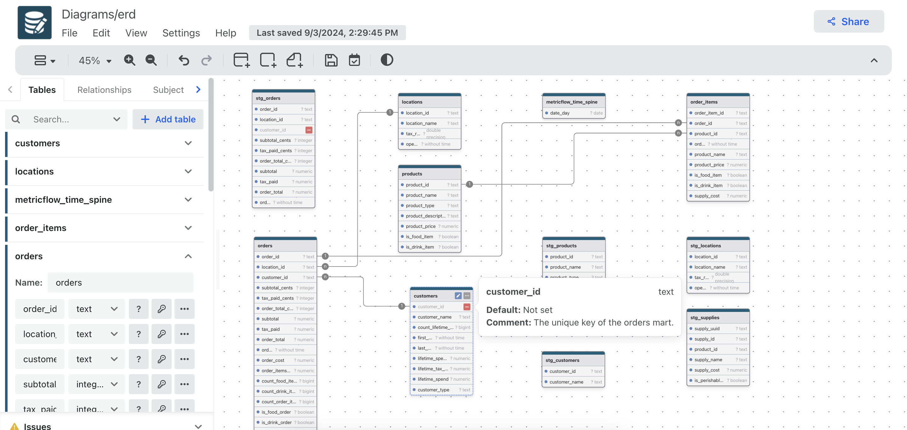

# Generate DrawDB

## 1. Produce dbt artifact files

Let's use [Jaffle-Shop](https://github.com/dbt-labs/jaffle-shop) as the example.

Clone it, then perform the `dbt docs generate` in order to generate the `/target` folder containing:

- `manifest.json`
- `catalog.json`

Or we can use the generated files found in the [samples](https://github.com/datnguye/dbterd/tree/main/samples/jaffle-shop)

## 2. Generate DrawDB (.ddb) file

In the same dbt project directory, let's run `dbterd` command to generate the `.ddb` file which is the supported import file format, actually it is `json` file

```shell
dbterd run -t drawdb -enf table
```

There we go, here is the sample output content:

```json
{
  "author": "dbterd",
  "title": "erd",
  "date": "2024-07-28T01:54:24.620460Z",
  "tables": [
    ...
    {
      "id": 3,
      "name": "order_items",
      ...
    }
    ...
    {
      "id": 4,
      "name": "orders",
      ...
    }
  ],
  "relationships": [
    {
      "id": 0,
      "name": "fk__order_items_orders__order_id",
      "cardinality": "Many to one",
      "startTableId": 3,
      "endTableId": 4,
      "startFieldId": 1,
      "endFieldId": 0,
      ...
    },
...
```

> Check full sample at [samples/jaffle-shop/erd.ddb](https://github.com/datnguye/dbterd/blob/main/samples/jaffle-shop/erd.ddb)

## 3. Import to Draw DB Editor

Go to the [Draw DB Editor](https://drawdb.vercel.app/editor) playaround:

- Files > Import diagram
- Choose the generated file e.g. `erd.ddb`
- Click `Import`

Voila 🎉, here the result:


