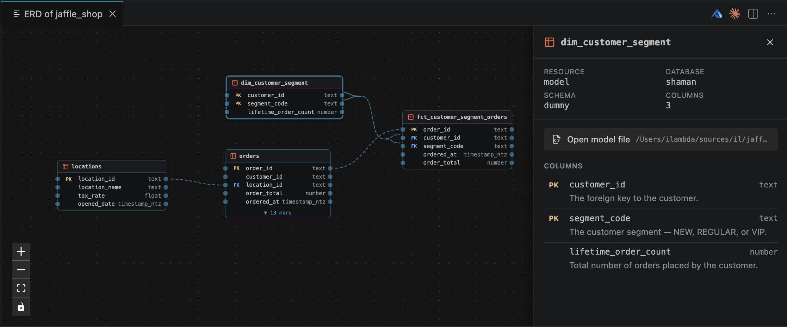
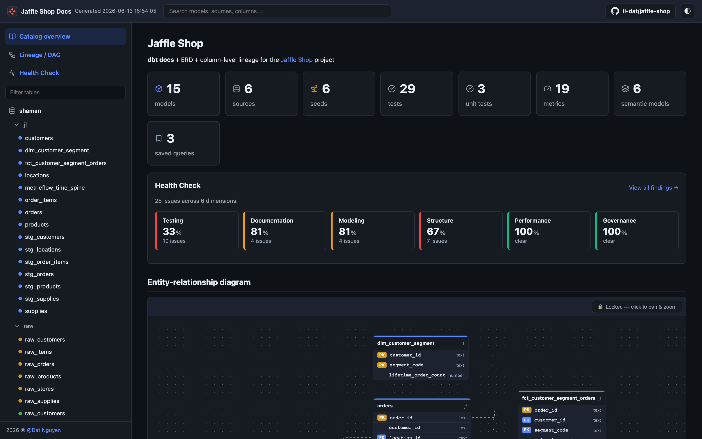
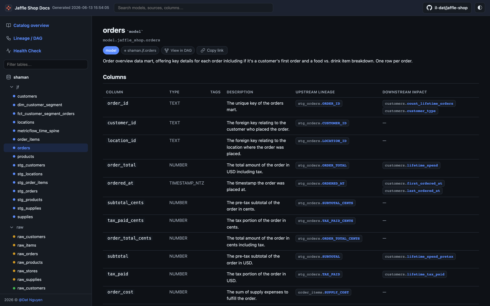

# Generate JSON

The `json` target emits dbterd's **canonical ERD payload** — a stable, schema-validated
shape (`nodes` / `edges` / `metadata`) designed to be consumed by other tools rather than
imported into a drawing app. It's the format the
[dbterd VS Code extension](https://github.com/datnguye/dbterd-vscode) and the
[Jaffle Shop Docs](https://github.com/datnguye/dbt-docs) site (a dbt-docs fork) both speak
natively, so if you're building an integration this is the target you want.

## 1. Produce dbt artifact files

Let's use [Jaffle-Shop](https://github.com/dbt-labs/jaffle-shop) as the example.

Clone it, then run `dbt docs generate` to produce the `/target` folder containing:

- `manifest.json`
- `catalog.json`

Or just use the generated files in the [samples](https://github.com/datnguye/dbterd/tree/main/samples/jaffle-shop).

## 2. Generate the JSON file

In the same dbt project directory, run `dbterd` to generate the `.json` file:

```bash
dbterd run -t json
```

Here is a trimmed sample of the output:

```json
{
  "$schema": "https://dbterd.datnguye.me/latest/schemas/erd/latest/erd.json",
  "nodes": [
    {
      "id": "model.jaffle_shop.orders",
      "name": "orders",
      "label": null,
      "description": "One row per order.",
      "resource_type": "model",
      "schema_name": "analytics",
      "database": "prod",
      "columns": [
        {
          "name": "order_id",
          "data_type": "INT",
          "description": "The primary key.",
          "is_primary_key": true,
          "is_foreign_key": false
        }
      ],
      "compiled_sql": null
    }
  ],
  "edges": [
    {
      "id": "test.jaffle_shop.relationships_order_items_order_id",
      "from_id": "model.jaffle_shop.order_items",
      "to_id": "model.jaffle_shop.orders",
      "from_columns": ["order_id"],
      "to_columns": ["order_id"],
      "relationship_type": "fk",
      "name": "test.jaffle_shop.relationships_order_items_order_id",
      "label": null,
      "cardinality": "n1"
    }
  ],
  "metadata": {
    "generated_at": "2024-07-28T01:54:24.620460Z",
    "dbt_project_name": "jaffle_shop",
    "dbterd_version": "1.2.3"
  }
}
```

## Sample config

Rather than passing a fistful of flags every run, drop a `.dbterd.yml` next to your dbt
project. The demo above is generated from a config like this — it scopes the JSON down to a
handful of marts and uses short table names. The same file is honored by the
[dbterd VS Code extension](https://github.com/datnguye/dbterd-vscode) on every `Open ERD`, so
CLI and editor stay in lockstep:

```yaml
# .dbterd.yml

# Detect FKs from dbt `foreign_key` model contracts (not `relationships` tests).
algo: model_contract

# Short node labels (e.g. "orders" instead of "model.jaffle_shop.orders").
entity-name-format: model

# Modelled tables only.
resource-type:
  - model

# Narrow to exactly the marts you care about.
#
# Note: dbterd's selectors match against the fully-qualified `node_name`
# (e.g. "model.jaffle_shop.orders"), not the short name — hence the prefix on
# every pattern below.
select:
  - exact:model.jaffle_shop.locations
  - exact:model.jaffle_shop.orders
  - wildcard:model.jaffle_shop.dim_*
  - wildcard:model.jaffle_shop.fct_*
```

See the [configuration file](./../configuration-file.md) guide for the full list of keys.

## 3. Validate against the schema

Every payload carries a `$schema` URL pinned to the dbterd version that produced it. The
schema is published on this site at
[`schemas/erd/latest/erd.json`](https://dbterd.datnguye.me/latest/schemas/erd/latest/erd.json)
(versioned copies live at `schemas/erd/{version}/erd.json`), so you can validate output in CI:

```bash
# any draft 2020-12 validator works; example with check-jsonschema
pipx run check-jsonschema --schemafile \
  https://dbterd.datnguye.me/latest/schemas/erd/latest/erd.json \
  output.json
```

## Field reference

| Object   | Field               | Notes                                                            |
| -------- | ------------------- | ---------------------------------------------------------------- |
| node     | `id`                | dbt unique id, e.g. `model.jaffle_shop.orders`                   |
| node     | `name`              | Friendly table name (respects `--entity-name-format`)           |
| node     | `resource_type`     | `model` / `source` / `seed` / `snapshot`                        |
| node     | `schema_name`       | dbt schema                                                       |
| node     | `database`          | dbt database                                                     |
| node     | `compiled_sql`      | Compiled SQL (falls back to raw dbt code); `null` when absent    |
| column   | `is_primary_key`    | True when the column is the model's primary key                  |
| column   | `is_foreign_key`    | Derived — true when the column participates in a relationship    |
| edge     | `from_id` / `to_id` | FK (child) side → referenced (parent) side                       |
| edge     | `from_columns`      | Full column list; supports composite foreign keys               |
| edge     | `cardinality`       | dbterd code: `n1`, `1n`, `11`, `nn`, `01`, `0n`                 |
| metadata | `generated_at`      | Manifest generation timestamp                                    |
| metadata | `dbterd_version`    | dbterd version that produced the payload (matches `$schema`)     |

## 4. (Optional) Render it in VS Code

The JSON isn't meant to be read by humans — it's meant to be drawn. The
[dbterd VS Code extension](https://github.com/datnguye/dbterd-vscode) consumes this payload
directly: hit `dbterd: Open ERD` and you get an interactive diagram next to your code, with a
detail panel for the model under your cursor — primary keys, foreign keys, schema, and column
descriptions, all from the payload:



## 5. (Optional) Render it on a static docs site

Because the payload is a clean `nodes` / `edges` graph, a downstream UI can render it straight
away — no parsing of DBML or PlantUML required. The
[Jaffle Shop Docs](https://github.com/datnguye/dbt-docs) site (a dbt-docs fork) reads this
exact JSON to draw an interactive entity-relationship diagram right on its catalog overview.
See it live in the [demo site](https://dbdocs.datnguye.me/latest/demo/latest/):



Click any table and you drop into a model page with the column-level detail — primary keys,
foreign keys, data types, and descriptions — all sourced from the same payload's `columns`
array:


