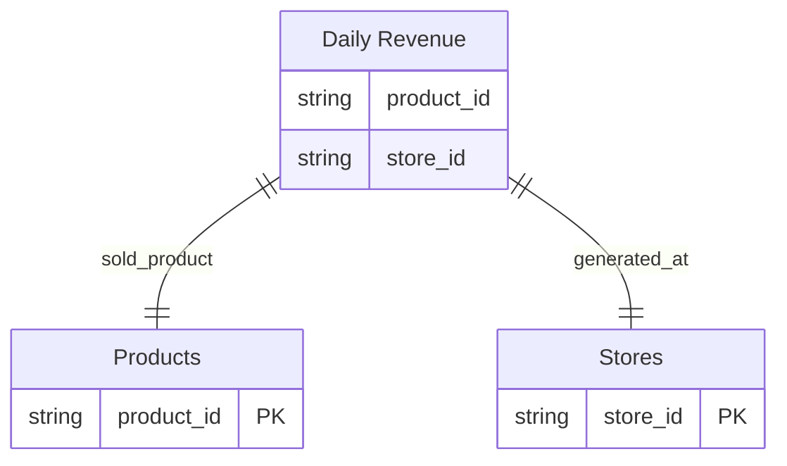

## Override Display Names for Tables and References

Customize how tables and relationships appear in your ERD by using the `label` and `relationship_label` metadata attributes.

### Override Table Display Names

Add `label` attribute to your model's meta to customize its display name in the ERD:

```yaml
models:
  - name: axw_derived__rpt_ccd_customers_hist
    meta:
      label: customers
    columns:
      - name: customer_id
        description: Primary key for customers
```

This will display the model as `customers` in the ERD instead of the actual model name `axw_derived__rpt_ccd_customers_hist`.

### Override Relationship Display Names

Add `relationship_label` attribute to your test's meta to customize the relationship name:

```yaml
models:
  - name: orders
    columns:
      - name: customer_id
        tests:
          - relationships:
              to: ref('customers')
              field: customer_id
              meta:
                relationship_label: placed_by
```

This will display the relationship as `placed_by` instead of the default relationship name.

### Use Cases

- **Simplify complex naming conventions**: Transform technical names like `stg_erp__customer_master_v2` to readable names like `Customers`
- **Business-friendly diagrams**: Create ERDs that use business terminology instead of technical database names
- **Multi-tenant scenarios**: Customize display names for different clients or environments
- **Internationalization**: Display table names in different languages while maintaining consistent model names

### Example

Here's a complete example showing both table and relationship label overrides:

```yaml
models:
  - name: fct_daily_revenue_agg
    meta:
      label: Daily Revenue
    columns:
      - name: product_id
        tests:
          - relationships:
              to: ref('dim_product_catalog')
              field: product_id
              meta:
                relationship_label: sold_product
      - name: store_id
        tests:
          - relationships:
              to: ref('dim_store_locations')
              field: store_id
              meta:
                relationship_label: generated_at

  - name: dim_product_catalog
    meta:
      label: Products
    columns:
      - name: product_id
        description: Primary key

  - name: dim_store_locations
    meta:
      label: Stores
    columns:
      - name: store_id
        description: Primary key
```

This configuration will generate an ERD where:
- `fct_daily_revenue_agg` appears as `Daily Revenue`
- `dim_product_catalog` appears as `Products`
- `dim_store_locations` appears as `Stores`
- The relationship from Daily Revenue to Products is labeled as `sold_product`
- The relationship from Daily Revenue to Stores is labeled as `generated_at`

The resulting ERD would look like this:



> **Note**: If no `label` is specified, the original model name will be used. Similarly, if no `relationship_label` is specified, the default relationship naming will apply.

### Related Options

The `label` metadata override works in conjunction with the `--entity-name-format` CLI option:

- **`--entity-name-format`**: Controls the default naming format for entities when no `label` override is specified
  - Default: `resource.package.model` (e.g., `model.jaffle_shop.customers`)
  - Other options: `database.schema.table`, `schema.table`, `table`, etc.
  - Example: `dbterd run --entity-name-format schema.table`

When both are used:
- The `label` metadata takes precedence over `--entity-name-format`
- Entities with `label` metadata will display the custom label
- Entities without `label` metadata will use the format specified by `--entity-name-format`

This allows for flexible naming strategies where you can set a general naming convention with `--entity-name-format` and override specific models with the `label` metadata.
