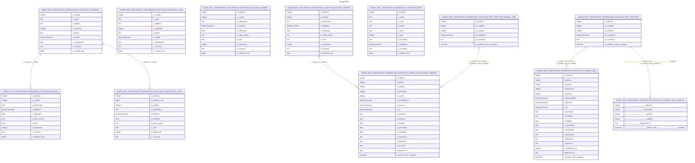

# Sample Mermaid ERD

```mermaid
---
title: Sample ERD
---
erDiagram
  "MODEL.DBT_CONSTRAINTS_INTEGRATION_TESTS.DIM_CUSTOMERS" {
    integer c_custkey
    text c_name
    text c_address
    integer c_nationkey
    text c_phone
    double-precision c_acctbal
    text c_mktsegment
    text c_comment
    bigint c_custkey_seq
  }
  "MODEL.DBT_CONSTRAINTS_INTEGRATION_TESTS.DIM_CUSTOMERS_VIEW" {
    integer c_custkey
    text c_name
    text c_address
    integer c_nationkey
    text c_phone
    double-precision c_acctbal
    text c_mktsegment
    text c_comment
    bigint c_custkey_seq
  }
  "MODEL.DBT_CONSTRAINTS_INTEGRATION_TESTS.DIM_DUPLICATE_ORDERS" {
    integer o_orderkey
    integer o_custkey
    text o_orderstatus
    double-precision o_totalprice
    date o_orderdate
    text o_order_priority
    text o_clerk
    integer o_shippriority
    text o_comment
    bigint o_orderkey_seq
  }
  "MODEL.DBT_CONSTRAINTS_INTEGRATION_TESTS.DIM_MISSING_ORDERS" {
    integer o_orderkey
    integer o_custkey
    text o_orderstatus
    double-precision o_totalprice
    date o_orderdate
    text o_order_priority
    text o_clerk
    integer o_shippriority
    text o_comment
    bigint o_orderkey_seq
  }
  "MODEL.DBT_CONSTRAINTS_INTEGRATION_TESTS.DIM_ORDERS" {
    integer o_orderkey
    integer o_custkey
    text o_orderstatus
    double-precision o_totalprice
    date o_orderdate
    text o_order_priority
    text o_clerk
    integer o_shippriority
    text o_comment
    bigint o_orderkey_seq
  }
  "MODEL.DBT_CONSTRAINTS_INTEGRATION_TESTS.DIM_ORDERS_NULL_KEYS" {
    integer o_orderkey
    bigint o_orderkey_seq
    integer o_custkey
    text o_orderstatus
    double-precision o_totalprice
    date o_orderdate
    text o_order_priority
    text o_clerk
    integer o_shippriority
    text o_comment
  }
  "MODEL.DBT_CONSTRAINTS_INTEGRATION_TESTS.DIM_PART" {
    integer p_partkey
    text p_name
    text p_mfgr
    text p_brand
    text p_type
    integer p_size
    text p_container
    double-precision p_retailprice
    text p_comment
    bigint p_partkey_seq
  }
  "MODEL.DBT_CONSTRAINTS_INTEGRATION_TESTS.DIM_PART_SUPPLIER" {
    integer ps_partkey
    integer ps_suppkey
    integer ps_availqty
    double-precision ps_supplycost
    text ps_comment
    unknown ps_partkey_and_ps_suppkey
  }
  "MODEL.DBT_CONSTRAINTS_INTEGRATION_TESTS.DIM_PART_SUPPLIER_MISSING_CON" {
    integer ps_partkey
    integer ps_suppkey
    integer ps_availqty
    double-precision ps_supplycost
    text ps_comment
    unknown ps_partkey_and_ps_suppkey
  }
  "MODEL.DBT_CONSTRAINTS_INTEGRATION_TESTS.FACT_ORDER_LINE" {
    integer l_orderkey
    integer l_partkey
    integer l_suppkey
    integer l_linenumber
    integer l_quantity
    double-precision l_extendedprice
    double-precision l_discount
    double-precision l_tax
    text l_returnflag
    text l_linestatus
    date l_shipdate
    date l_commitdate
    date l_receiptdate
    text l_shipinstruct
    text l_shipmode
    text l_comment
    integer o_orderdate_key
    text integration_id
    unknown l_partkey_and_l_suppkey
  }
  "MODEL.DBT_CONSTRAINTS_INTEGRATION_TESTS.FACT_ORDER_LINE_LONGCOL" {
    integer l_____________________orderkey
    integer l___________________linenumber
    integer l______________________partkey
    integer l______________________suppkey
    text l_______________integration_id
    unknown l______________________partkey_and_l______________________suppkey
  }
  "MODEL.DBT_CONSTRAINTS_INTEGRATION_TESTS.FACT_ORDER_LINE_MISSING_ORDERS" {
    integer l_orderkey
    integer l_partkey
    integer l_suppkey
    integer l_linenumber
    integer l_quantity
    double-precision l_extendedprice
    double-precision l_discount
    double-precision l_tax
    text l_returnflag
    text l_linestatus
    date l_shipdate
    date l_commitdate
    date l_receiptdate
    text l_shipinstruct
    text l_shipmode
    text l_comment
    text integration_id
    unknown l_partkey_and_l_suppkey
  }
  "MODEL.DBT_CONSTRAINTS_INTEGRATION_TESTS.DIM_CUSTOMERS" ||--o{ "MODEL.DBT_CONSTRAINTS_INTEGRATION_TESTS.DIM_ORDERS": o_custkey--c_custkey
  "MODEL.DBT_CONSTRAINTS_INTEGRATION_TESTS.DIM_PART_SUPPLIER" ||--o{ "MODEL.DBT_CONSTRAINTS_INTEGRATION_TESTS.FACT_ORDER_LINE": l_partkey_and_l_suppkey--ps_partkey_and_ps_suppkey
  "MODEL.DBT_CONSTRAINTS_INTEGRATION_TESTS.DIM_MISSING_ORDERS" ||--o{ "MODEL.DBT_CONSTRAINTS_INTEGRATION_TESTS.FACT_ORDER_LINE_MISSING_ORDERS": l_orderkey--o_orderkey
  "MODEL.DBT_CONSTRAINTS_INTEGRATION_TESTS.DIM_PART_SUPPLIER_MISSING_CON" ||--o{ "MODEL.DBT_CONSTRAINTS_INTEGRATION_TESTS.FACT_ORDER_LINE_MISSING_ORDERS": l_partkey_and_l_suppkey--ps_partkey_and_ps_suppkey
  "MODEL.DBT_CONSTRAINTS_INTEGRATION_TESTS.DIM_CUSTOMERS" ||--o{ "MODEL.DBT_CONSTRAINTS_INTEGRATION_TESTS.DIM_ORDERS_NULL_KEYS": o_custkey--c_custkey
  "MODEL.DBT_CONSTRAINTS_INTEGRATION_TESTS.DIM_PART_SUPPLIER" ||--o{ "MODEL.DBT_CONSTRAINTS_INTEGRATION_TESTS.FACT_ORDER_LINE_LONGCOL": l______________________partkey_and_l______________________suppkey--ps_partkey_and_ps_suppkey

```
