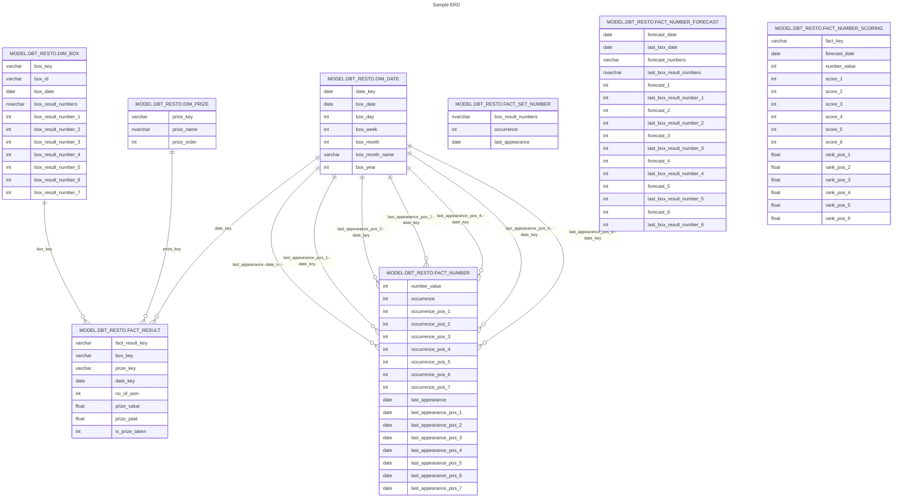

```mermaid
---
title: Sample ERD
---
erDiagram
  "MODEL.DBT_RESTO.DIM_BOX" {
    varchar box_key
    varchar box_id
    date box_date
    nvarchar box_result_numbers
    int box_result_number_1
    int box_result_number_2
    int box_result_number_3
    int box_result_number_4
    int box_result_number_5
    int box_result_number_6
    int box_result_number_7
  }
  "MODEL.DBT_RESTO.DIM_DATE" {
    date date_key
    date box_date
    int box_day
    int box_week
    int box_month
    varchar box_month_name
    int box_year
  }
  "MODEL.DBT_RESTO.DIM_PRIZE" {
    varchar prize_key
    nvarchar prize_name
    int prize_order
  }
  "MODEL.DBT_RESTO.FACT_NUMBER" {
    int number_value
    int occurrence
    int occurrence_pos_1
    int occurrence_pos_2
    int occurrence_pos_3
    int occurrence_pos_4
    int occurrence_pos_5
    int occurrence_pos_6
    int occurrence_pos_7
    date last_appearance
    date last_appearance_pos_1
    date last_appearance_pos_2
    date last_appearance_pos_3
    date last_appearance_pos_4
    date last_appearance_pos_5
    date last_appearance_pos_6
    date last_appearance_pos_7
  }
  "MODEL.DBT_RESTO.FACT_RESULT" {
    varchar fact_result_key
    varchar box_key
    varchar prize_key
    date date_key
    int no_of_won
    float prize_value
    float prize_paid
    int is_prize_taken
  }
  "MODEL.DBT_RESTO.FACT_SET_NUMBER" {
    nvarchar box_result_numbers
    int occurrence
    date last_appearance
  }
  "MODEL.DBT_RESTO.FACT_NUMBER_FORECAST" {
    date forecast_date
    date last_box_date
    varchar forecast_numbers
    nvarchar last_box_result_numbers
    int forecast_1
    int last_box_result_number_1
    int forecast_2
    int last_box_result_number_2
    int forecast_3
    int last_box_result_number_3
    int forecast_4
    int last_box_result_number_4
    int forecast_5
    int last_box_result_number_5
    int forecast_6
    int last_box_result_number_6
  }
  "MODEL.DBT_RESTO.FACT_NUMBER_SCORING" {
    varchar fact_key
    date forecast_date
    int number_value
    int score_1
    int score_2
    int score_3
    int score_4
    int score_5
    int score_6
    float rank_pos_1
    float rank_pos_2
    float rank_pos_3
    float rank_pos_4
    float rank_pos_5
    float rank_pos_6
  }
  "MODEL.DBT_RESTO.DIM_DATE" ||--o{ "MODEL.DBT_RESTO.FACT_NUMBER": last_appearance--date_key
  "MODEL.DBT_RESTO.DIM_DATE" ||--o{ "MODEL.DBT_RESTO.FACT_NUMBER": last_appearance_pos_1--date_key
  "MODEL.DBT_RESTO.DIM_DATE" ||--o{ "MODEL.DBT_RESTO.FACT_NUMBER": last_appearance_pos_2--date_key
  "MODEL.DBT_RESTO.DIM_DATE" ||--o{ "MODEL.DBT_RESTO.FACT_NUMBER": last_appearance_pos_3--date_key
  "MODEL.DBT_RESTO.DIM_DATE" ||--o{ "MODEL.DBT_RESTO.FACT_NUMBER": last_appearance_pos_4--date_key
  "MODEL.DBT_RESTO.DIM_DATE" ||--o{ "MODEL.DBT_RESTO.FACT_NUMBER": last_appearance_pos_5--date_key
  "MODEL.DBT_RESTO.DIM_DATE" ||--o{ "MODEL.DBT_RESTO.FACT_NUMBER": last_appearance_pos_6--date_key
  "MODEL.DBT_RESTO.DIM_BOX" ||--o{ "MODEL.DBT_RESTO.FACT_RESULT": box_key
  "MODEL.DBT_RESTO.DIM_PRIZE" ||--o{ "MODEL.DBT_RESTO.FACT_RESULT": prize_key
  "MODEL.DBT_RESTO.DIM_DATE" ||--o{ "MODEL.DBT_RESTO.FACT_RESULT": date_key
```
